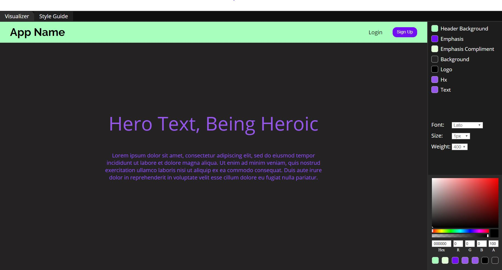

# Style Guide Visualizer and Generator  

### Summary  

Visually test out different color and typography combinations, with freedom to change individual components color, font, and text. The style guide is always accessible by simply switching tabs and is automatically generated to show the users choices.

This project is ongoing and all content and functionality is subject to change.

### Technologies

* React
* React Hooks
* TypeScript
* Redux
* React Color

### Visualizer Screen Shot  

### Style Guide Screen Shot  

